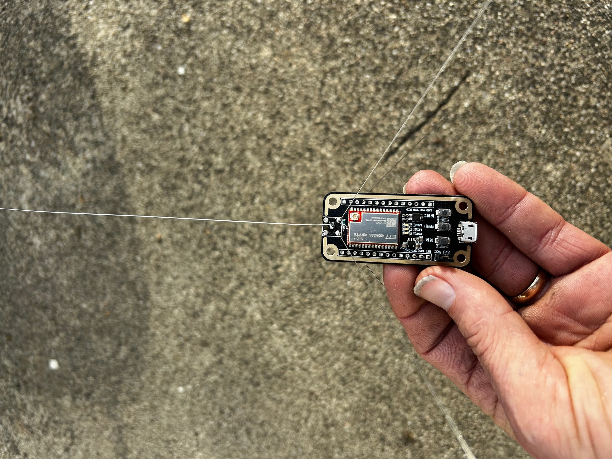
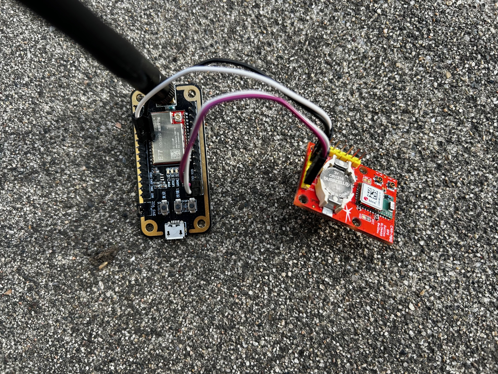
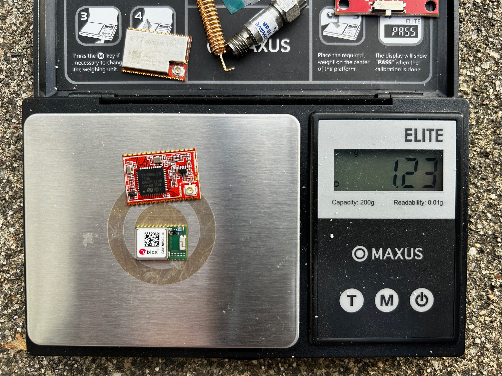

# PicoTrack

PicoTrack uses one of the smallest combined mcu/LoRa transmitter modules that is currently available. Currently testing is being done with development boards ([Ebyte's E77 dev board 400 mhz](https://www.cdebyte.com/products/E77-400MBL-01) version, and [Watterott's CAM-M8Q breakout board](https://github.com/watterott/CAM-M8Q-Breakout)). In the future, a small, light board that holds these modules will be made. There is a lot of room for lightening this up. The two modules together weigh in at about 1.3 grams!

I have used plenty of LightTracker 1.1 433MHz open source code, as well as some example code from different libraries. 

( Update: I was able to port the complete code from LightTracker 1.1 433MHz for the E77 module. That code is located here: https://github.com/radiohound/Pico_Lora_APRS )

**Important :** 433 MHz may require an amateur radio license to operate if 433 MHz is not ISM band in your country. So check regulations before using it.
